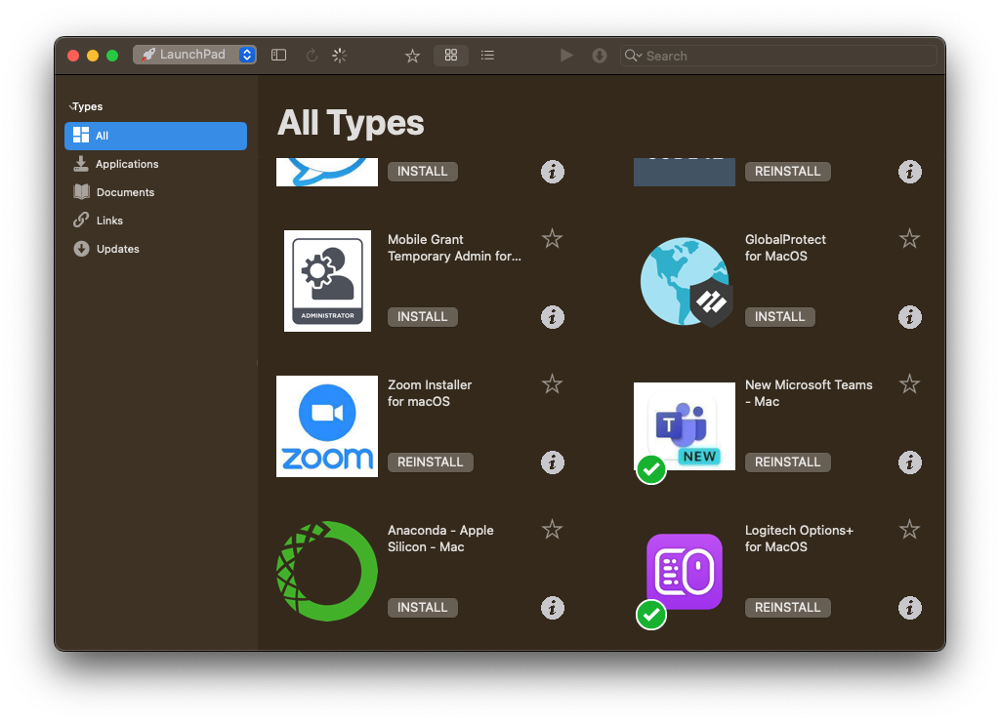

# MODAQ Toolkit

A Python-based data conversion library that transforms MODAQ MCAP files into columnar time series
data using [Apache Parquet](https://parquet.apache.org/). Parquet offers an optimal balance of type
safety, storage efficiency, and cross-language support, making it more efficient than
CSV and easier to work with than raw MODAQ output.

### Why Parquet?

- Database-like features including partitioning and filtering
- Schema enforcement with strict typing
- 10-20x smaller file sizes compared to CSV
- Wide language support through official and community libraries:
  - Python:
    - [pandas](https://pandas.pydata.org/docs/reference/api/pandas.read_parquet.html)
    - [Polars](https://docs.pola.rs/api/python/stable/reference/index.html)
  - MATLAB: [Built-in support](https://www.mathworks.com/help/matlab/ref/matlab.io.datastore.parquetdatastore.html)
  - C++: [Arrow](https://arrow.apache.org/docs/cpp/parquet.html)
  - Rust: [Polars](https://docs.rs/polars/latest/polars/)

## Quick Start

### Quick install from GitHub:

```bash
pip install git+https://github.nrel.gov/Water-Power/modaq_toolkit.git
```

For detailed installation options including conda environments, specific versions, and development setup, see the [Installation section](#installation) below.

### Usage

#### Command Line

Basic usage:

```bash
modaq -i /path/to/mcap/files -o /path/to/output
```

Available arguments:

| Argument             | Description                                                                     | Required | Default   |
| -------------------- | ------------------------------------------------------------------------------- | -------- | --------- |
| `-i`, `--input-dir`  | Directory containing MCAP files                                                 | Yes      | -         |
| `-o`, `--output-dir` | Directory for output                                                            | No       | `./data/` |
| `--async`            | Enable asynchronous processing of MCAP files (Much faster, but uses more cores) | No       | `False`   |

Example with all options:

```bash
modaq -i /path/to/mcap/files -o /path/to/output --async
```

#### Python

```python
# Convert multiple MCAP files
from modaq_toolkit import process_mcap_files
process_mcap_files("input_directory", "output_directory")

# Or work with a single file
from modaq_toolkit import MCAPParser
parser = MCAPParser("path/to/file.mcap")
parser.read_mcap()
parser.create_output("output_directory")
```

## Output Structure

The toolkit processes data in two stages:

1. `a1_one_to_one/`: Preserves the original data structure

   - Contains Parquet files organized by topic
   - Includes metadata describing schemas and structure

2. `a2_real_data/`: Optimizes data for time series analysis
   - Expands array data for easier analysis
   - Maintains same file organization as stage 1

## Using Parquet Data

### Python with pandas

Read all Parquet files from a directory:

```python
from pathlib import Path

import pandas as pd

# Read all parquet files in a directory
# Path uses forward slash on Windows, MacOS and Linux
directory = Path("path/to/parquet/files").resolve()

df = pd.read_parquet(directory)

# Ensure that the data is sorted by time
df = df.sort_index()

# Print a summary of the df
print(df.info())

# Print the first 5 rows of df
print(df.head())
```

Read a single Parquet file:

```python
import pandas as pd

parquet_file = Path("path/to/file.parquet").resolve()
# Read single parquet file and sort by time
df = pd.read_parquet(parquet_file)
df = df.sort_values('time')

# Print a summary of the df
print(df.info())

# Print the first 5 rows of df
print(df.head())
```

### MATLAB

Read all Parquet files from a directory:

```matlab
% Create a datastore for the directory
ds = parquetDatastore("path/to/parquet/files", "OutputType", "timetable");

% Preview the dataset
preview(ds)

% Read all data and convert to table
df = readall(ds);

% Sort by time
df = sortrows(df, 'time');
```

Read a single Parquet file:

```matlab
% Read single parquet file
df = parquetread("path/to/file.parquet");
```

Note: MODAQ data always includes a `time` column which should be used for sorting and time series analysis.

## Installation

### 1. Prerequisites: Install Python/Anaconda

**For NREL Enterprise Users:**

1. Open "Portal Manager" on your NREL workstation



2. Browse to the Anaconda package
3. Click "Install" to get the full Anaconda distribution with Python

**For Non-NREL Users:**

- Download either:
  - [Anaconda](https://www.anaconda.com/download) (full distribution with many pre-installed packages)
  - [Miniconda](https://docs.conda.io/en/latest/miniconda.html) (minimal distribution, recommended for most users)

Then create and activate a new environment:

```bash
# Create new environment with Python 3.10
conda create -n modaq python=3.10

# Activate the environment
# On Windows:
conda activate modaq
# On Unix-like systems:
source activate modaq
```

### 2. Easy Install (pip from GitHub)

For most users who just want to use the package, this is the recommended method:

```bash
pip install git+https://github.nrel.gov/Water-Power/modaq_toolkit.git
```

### 3. Complete Install (Clone & Development Setup)

For developers or those who need to modify the code:

1. Clone the repository:

   ```bash
   # HTTPS (Recommended for most users)
   git clone https://github.nrel.gov/Water-Power/modaq_toolkit

   # SSH (For contributors)
   git clone git@github.nrel.gov:Water-Power/modaq_toolkit.git
   ```

2. Navigate to repository:

   ```bash
   cd modaq_toolkit  # Adjust path as needed
   ```

3. Install in development mode:

   ```bash
   # Standard development install
   pip install -e .

   # Full development install with testing tools
   pip install -e ".[dev]"
   ```

Development install benefits:

- Code changes take effect immediately
- Source remains in original location
- Enables contributing back to the project
- Includes development tools with `[dev]` option

Would you like me to adjust any particular section or add more details to any part?

## Common Issues and Solutions

### Installation Problems

1. **Missing Dependencies**

   - Make sure you're using Python 3.10+
   - Check that all requirements are installed: `pip list`
   - Try reinstalling in a fresh conda environment

2. **Import Errors**
   - Verify your environment is activated
   - Ensure you're in the correct directory when installing
   - Check for any conflicting packages

### Data Processing

1. **Large Files**

   - Process files individually for better memory management
   - Use the command line tool for batch processing
   - Monitor system resources during conversion
   - Avoid processing files directly from OneDrive, network drives, or remote servers
     - These files must be downloaded locally first, which can significantly slow processing
     - Copy files to a local drive before processing for best performance

2. **Output Structure**
   - Check permissions in output directory
   - Verify input MCAP file integrity
   - Review logs for processing errors

## Support

For issues and feature requests, please use the GitHub issue tracker. Include:

- Your operating system and Python version
- Steps to reproduce the problem
- Any relevant error messages
- Example data (if possible)
